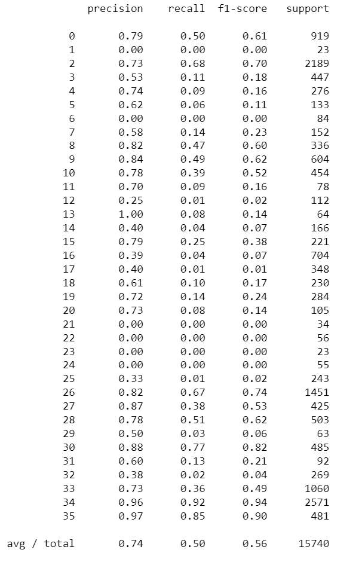

# Disaster Response Pipeline Project

# Table of Contents

1. [Instructions](#instructions)
2. [Summary](#summary)
3. [File Description](#file-desc)
4. [Dataset](#data)
5. [Data Cleaning and Pre-Processing](#data-cleaning)
6. [Modeling Process](#model)
7. [Model results](#result)

### Instructions:  

1. Go to the root directory of the project
2. Install the required packages
   
    `pip install -r requirements.txt`

3. Run the following commands to set up your database and model.

    - To run ETL pipeline that cleans data and stores in the database
        `python data/process_data.py data/disaster_messages.csv data/disaster_categories.csv data/DisasterResponse.db`
    - To run ML pipeline that trains classifier and saves
        `python models/train_classifier.py data/DisasterResponse.db models/classifier.pkl`

4. Run the following command in the app's directory to run your web app.
    `python run.py`

5. Open your browser and go to `localhost:3055`

### Summary: 
This project consists of analyzing the disaster data from Appen, Building a ML pipeline, optimize it and run it through an API that classifies the disaster messages.

The dataset contains real messages sent during multiple disaster events.

The goal is to create a ML pipeline to categorize the disaster messages so that the messages can be sent to an appropriate disaster relief agency.

The project consists of an app that takes as input a new message and classifies is into multiple categories. 

The web app will also display visualizations of the data

## File Description 

* [**ETL Pipeline Preparation.ipynb**](notebooks/ETL%20Pipeline%20Preparation.ipynb): 
Notebook that contain the ETL Pipeline.
* [**ML Pipeline Preparation.ipynb**](notebooks/ML%20Pipeline%20Preparation.ipynb): 
Notebook that contains the ML Pipeline.
* [**etl_pipeline_preparation.db**](data/etl%5Fpipeline%5Fpreparation.db): Database output of the ETL pipeline.
* [**disaster_categories.csv**](data/disaster%5Fcategories.csv): Categories original dataset.
* [**disaster_messages.csv**](data/disaster%5Fmessages.csv): Messages original dataset.
* [**classifier.pkl**](models/classifier.pkl): Trained model pickle file.
* [**train_classifier.py**](models/train%5Fclassifier.py): Python file for model training.
* [**process_data.py**](data/process_data.py): Python ETL script.
* [**app**](app/): Flask Web App
* [**run.py**](app/): Flask Web App main script.
* [**images**](images/): Image Folder
* [**requirements.txt**](/requirements.txt): Text file containing list of packages used.

### Dataset 
This disaster data is from [Appen](https://www.appen.com/)

The dataset consists of two files `disaster_messages.csv` and `disaster_categories.csv`.

### Data Cleaning and Pre-Processing 

1. Load the Datasets from the csv files.
2. Merge the 2 datasets based on the common `id`
3. Split the categories into seperate columns.
4. Convert the category values to 0 or 1.
5. Replace the categories column in merged df with new category columns.
6. Remove the duplicates.
7. Export the final df to `etl_pipeline_preparation.db` database in the data folder.

### Modeling Process 

1. Load the cleaned dataset from the database file.
2. Drop the `child_alone` column because all its values are 0.
3. Change the 2 values in the `related` column to the majority value 1 since the ratio of values = 2 is negligible (0.76%) compared to the 2 other values.
4. User One Hot Encoding to create columns for each `genre`
5. Tokenization function to process text data inputs.
6. Build a machine learning pipeline using CountVectorizer, TfidfVectorizer, and RandomForestClassifier.
7. Split the data into training and test sets.
8. Fit the Pipeline.
9. Test the Model.
10. Improve the model using GridSearch and Cross Validation to find the best random forest model for predicting disaster response category. Random Forest best parameters were 
<code>
{'clf__estimator__min_samples_split': 5,
 'clf__estimator__n_estimators': 10,
 'count_vectorizer__min_df': 1,
 'tfidf_transformer__use_idf': False}
</code>

11. Export the model as a pickel file
12. Further Improvements were tried to be made using other algorithms (i.e. SVC or ADABoost) or trying new estimators

### Model results 

The final RandomForestClassifier model with 5 fold cross-validation has the following results.

